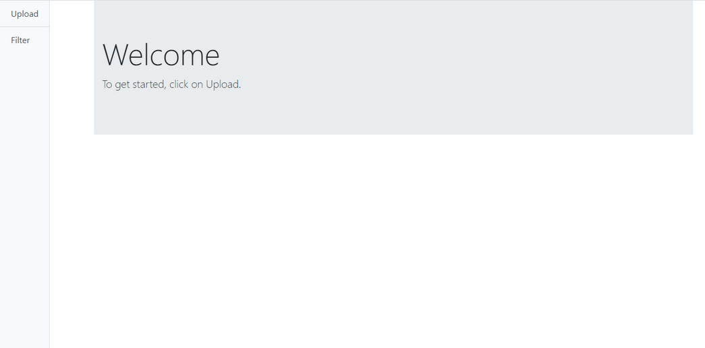
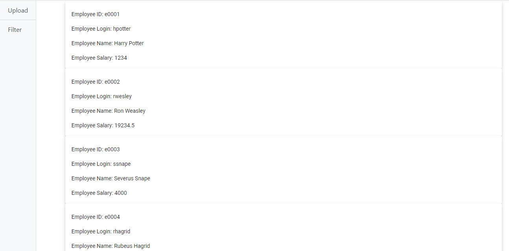
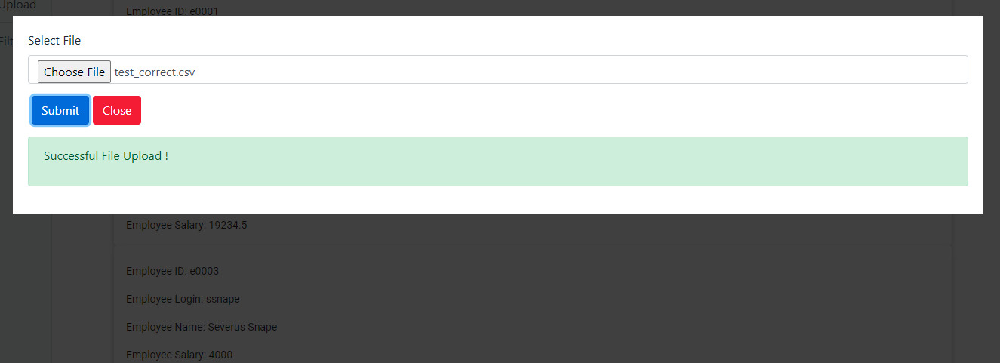
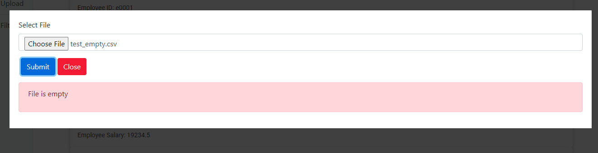

# Employee Management App

This project was generated with [Angular CLI](https://github.com/angular/angular-cli) version 9.1.6.

## Dependencies

1. BootStrap 4
2. Angular Material
3. Cypress for end to end tests
4. [Angular 9 - Modal Windows](https://jasonwatmore.com/post/2020/05/14/angular-9-modal-windows) by Jason Watmore

## Important to note

1. Test cases are in `cypress/integration/Tests` and test data can be found in `cypress/fixtures`
2. Assumptions are listed in the [backend repository](https://github.com/NUSe0032202/employeeapp)

## How to use

1. Download this repository and unzip the project to a desired folder
2. Run `npm install` to install all project dependencies
3. Run `ng serve` and navigate to `http://localhost:4200/`
4. To upload a file click on `Upload` on the sidebar, attach a file by clicking on `Choose File` before clicking on the `Submit` button. If the upload is successful, the records would be automatically rendered. If there is an error with the file, a message will be displayed underneath the `Submit` and `Close` button. Screenshots are shown below showing a succssful and failed upload.

5. To filter records, click on `Filter` on the sidebar and enter the desired filter parameters. When done, click on `Retrieve Records` and the records would be automatically rendered.
6. Note that the form data when using `Filter` and the file specified in `Upload` are saved even when the respective features are closed. Thus, they will still be shown when reopened.

