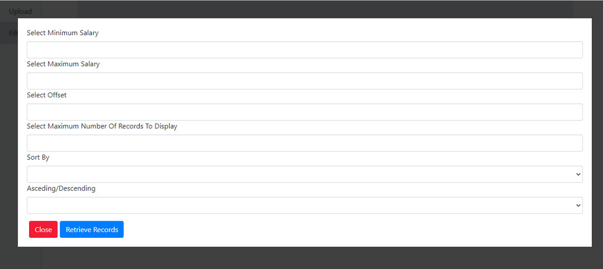

# Employee Management App

This project was generated with [Angular CLI](https://github.com/angular/angular-cli) version 9.1.6.

## How to use

1. Download this repository and unzip the project to a desired folder
2. Run `npm install` to install all project dependencies
3. Run `ng serve` and navigate to `http://localhost:4200/`

